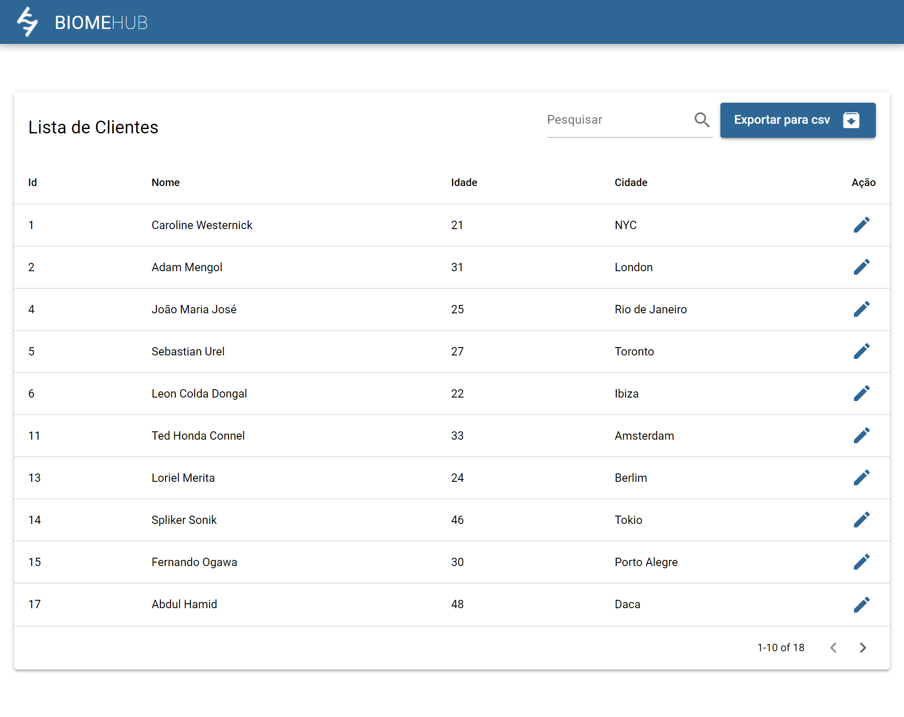
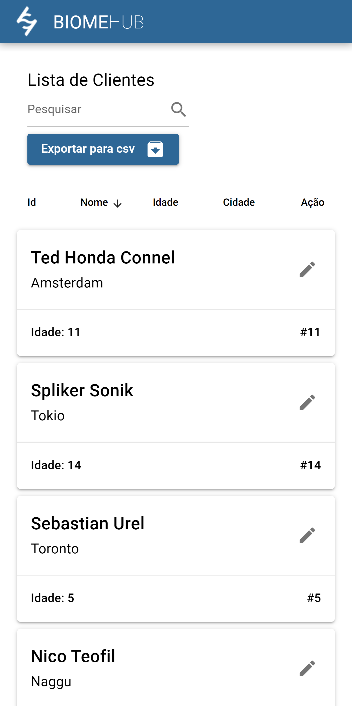
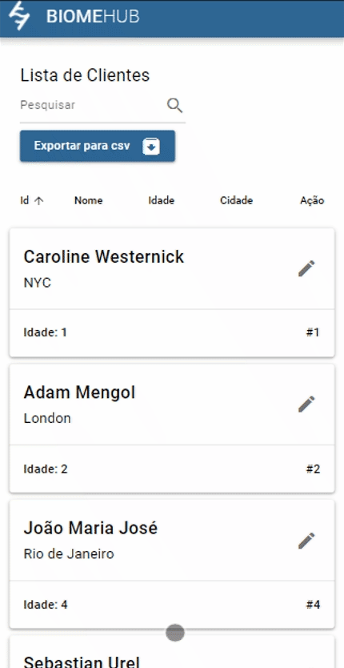
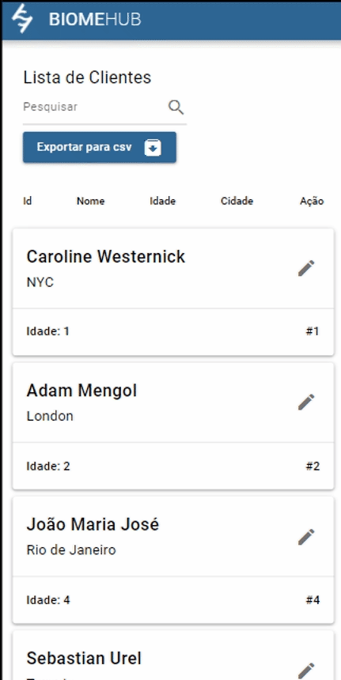

# BiomeHub App (biomehub-frontend) 

Listagem e edição de clientes

## :scroll: O que há no projeto?
### Tabela de clientes

Na tela inicial encontramos uma tabela com a listagem de clientes que é fornecida pela API.

<p float="left">
  
  
</p>

Nessa tabela podemos realizar a ordenação dos dados interagindo com os títulos respectivos no cabeçalho.

<p float="left">
  
  
</p>

Também é possível realizar filtragem por texto e exportação em CSV

<p float="left">
  
  
</p>

Ao interagir com o botão de edição de determinado cliente, prosseguimos para a página de edição


Podemos ver que o retorno visual de carregamento para o usuário é por meio do contorno da logotipo institucional animada.

Ao finalizar o envio das informações, somos direcionas de volta para a página de listagem e uma notificação é exibida com o sucesso da operação.

## :gear: Instalando e executando o projeto

### Clone esse repositório

```bash
git clone git@github.com:RuanAragao/teste-frontend-biomehub.git
```

### Instale as dependências

```bash
yarn
```

### Iniciando o servidor no modo de desenvolvimento (hot-code reloading, error reporting, etc.)
```bash
yarn dev
```

### Executar o lint
```bash
yarn lint // para corrigir os dados use a flag --fix
```

### Gere os arquivos de produção SPA
```bash
yarn build
```

### Gere os arquivos de produção PWA

```bash
yarn build:pwa
```


## Aplicação PWA em produção 

O projeto em produção pode ser acessado no seguinte link: https://teste-frontend-biomehub.vercel.app/
